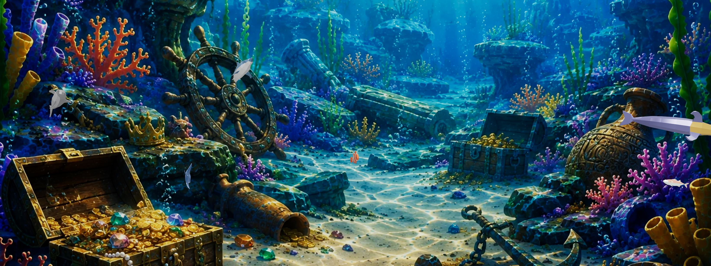
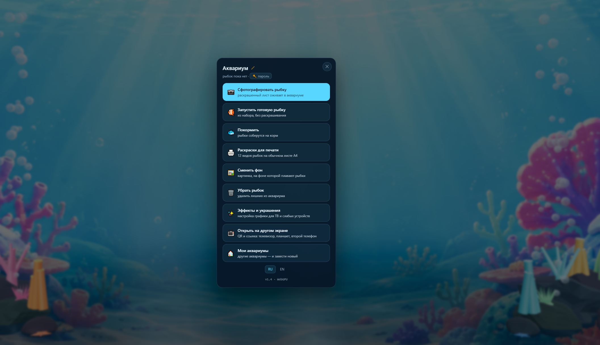
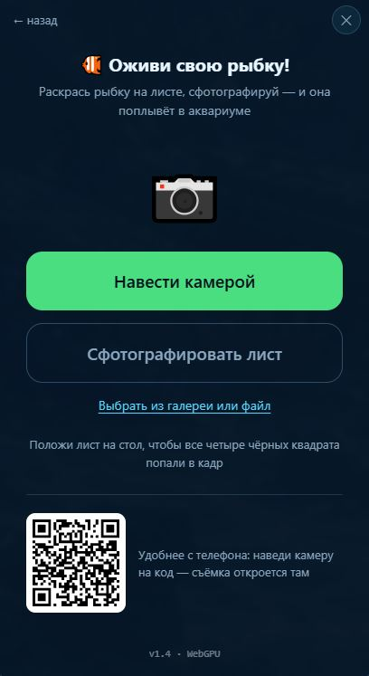
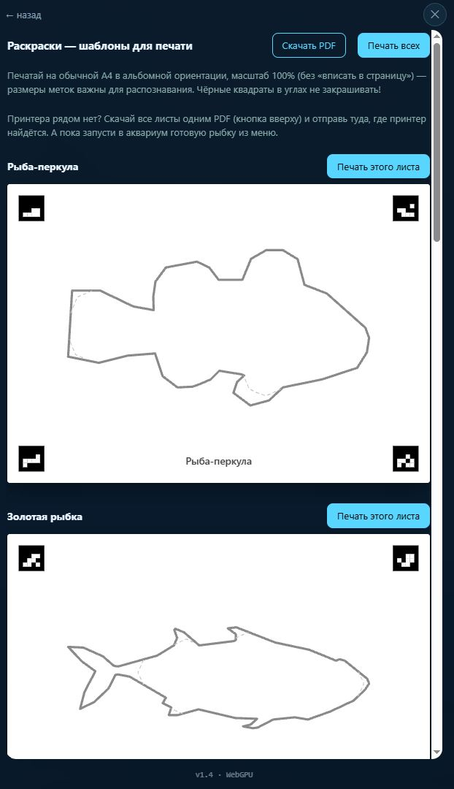
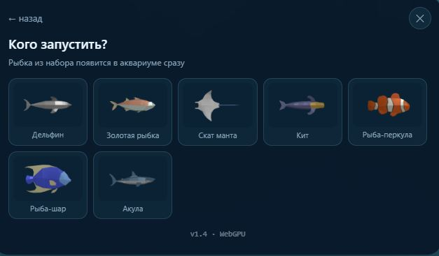
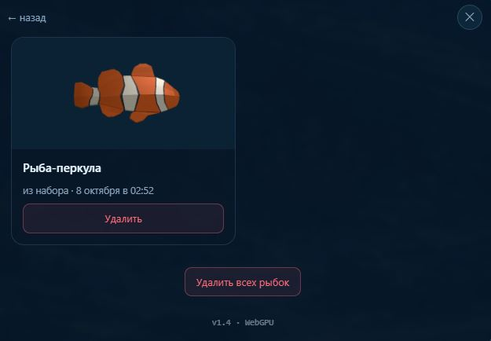
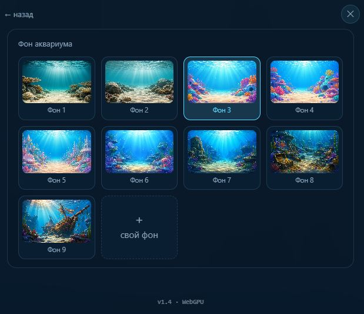
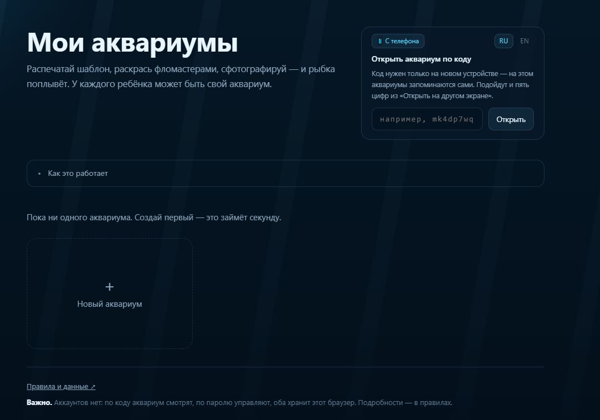

**English** · [Русский](README.ru.md)

# Paper Aquarium

A home game for a child, in the spirit of teamLab's *Sketch Aquarium*: print
a sheet, colour it with markers, take a photo with a phone — and the fish
starts swimming in an aquarium on the big screen.

```
A4 colouring sheet  →  phone photo  →  texture  →  3D fish in the scene
```

The server is plain Node with zero dependencies, the scene is three.js, and
everything the game owns lives in `data/`.

<p align="center">
  
</p>

<div align="center">

  <!-- Основные 4 экрана (2x2) -->
  <table align="center">
    <tr>
      <th align="center">The aquarium menu</th>
      <th align="center">The capture screen</th>
    </tr>
    <tr>
      <td align="center" valign="top">
        
        <br><br>
        <sub>Tap anywhere — a menu with every road out</sub>
      </td>
      <td align="center" valign="top">
        
        <br><br>
        <sub>The sheet is photographed right there, in a frame</sub>
      </td>
    </tr>
    <tr>
      <th align="center">Colouring sheets</th>
      <th align="center">Fish from the pack</th>
    </tr>
    <tr>
      <td align="center" valign="top">
        
        <br><br>
        <sub>Ready-to-print A4 sheets with corner markers</sub>
      </td>
      <td align="center" valign="top">
        
        <br><br>
        <sub>7 free 3D fish included out of the box</sub>
      </td>
    </tr>
  </table>

  <br>

  <!-- Дополнительные 3 экрана (3 в ряд) -->
  <table align="center">
    <tr>
      <th align="center">Fish list</th>
      <th align="center">Backgrounds</th>
      <th align="center">Aquarium list</th>
    </tr>
    <tr>
      <td align="center" valign="top">
        
        <br><br>
        <sub>The list of fish with their drawings</sub>
      </td>
      <td align="center" valign="top">
        
        <br><br>
        <sub>Choosing a background</sub>
      </td>
      <td align="center" valign="top">
        
        <br><br>
        <sub>The list of aquariums</sub>
      </td>
    </tr>
  </table>

</div>

## Key Features & Technologies

- 💻 **Standalone Windows Installer & Portable ZIP (Zero Setup):** One-click installer (`PaperAquarium-Setup.exe`) or portable archive (`PaperAquarium-Portable.zip`) with bundled runtime — no Node.js, git, or command line required! Native system tray launcher (`PaperAquarium.exe`), automatic browser startup, and port conflict resolution.
- 📱 **Instant Mobile Connection via QR Code:** Point any smartphone camera at the QR code on the home page (or `/qr`) to immediately open the aquarium on your mobile device over local Wi-Fi — no manual IP typing needed.
- 💾 **Permanent Data Persistence:** All created aquariums, children's drawings, fish names, custom backgrounds, and settings are automatically preserved across program restarts. Installed version safely stores data in `%APPDATA%\PaperAquarium\data` (surviving app updates), while portable mode saves directly to `./data`.
- 🎛️ **Granular Performance & Decoration Toggles:** Individual switches for underwater effects (Plankton particles, God Rays sunbeams, seabed bubbles, corals/rocks, and water caustics) to guarantee smooth 60 FPS on budget Smart TVs, TV boxes, and older devices.

- 🐟 **7 Free 3D Fish Models Out of the Box (CC0):** Percula clownfish, goldfish, pufferfish, manta ray, reef shark, minke whale, and bottlenose dolphin are already included in the repository with swimming skeletal animations. Clone and run — no purchases or downloads needed!
- 🎨 **WASM-Powered Computer Vision:** ArUco marker detection, perspective transformation, species contour extraction, and white balance normalization are accelerated via WebAssembly.
- 📱 **Low-End Mobile Optimization:** Adaptive resolution scaling during capture prevents Out-of-Memory (OOM) errors and camera crashes on budget smartphones while preserving sharp texture details. Supports both live camera stream and uploading existing photos from the gallery.
- 🌊 **Next-Gen WebGPU + TSL with WebGL Fallback:** Modern WebGPU renderer using Three Shading Language (TSL) with procedural underwater water caustics, falling back seamlessly to WebGL on legacy devices.
- 🪸 **Vibrant Underwater Atmosphere:** Volumetric sunbeams (God Rays), floating plankton, natural bubble streams rising from the seabed, underwater fog, and procedural ocean floor with rocks, sponges, and corals.
- 🤖 **Fish Behaviors (Boids):** Flocking simulation, boundary avoidance, natural 3D turns, and reactive feeding behavior.
- 🍞 **Interactive Gameplay:** Feed fish using the "Feed" button, give fish custom pet names directly from your smartphone, select procedural shader backgrounds, or upload custom image/video loops (.mp4 / .webm).
- 📺 **Fast TV Pairing:** A 5-digit temporary PIN connects Smart TVs in seconds without typing long URLs on a remote control.
- 🔒 **Security & Multi-Tenant Isolation:** Isolated aquariums addressed by 10-character cryptographic codes, salt + scrypt password hashing for administrative actions, brute-force protection, and disk quota limits.
- 🌍 **Bilingual (i18n):** User interface, coloring sheets, PDF albums, and terms are fully translated into English and Russian.
- 🛡️ **Zero-Dependency & GDPR Compliant:** Server built with pure Node.js (zero npm dependencies), zero trackers or marketing cookies, and automated 30-day trash purging.

## Quick Start (Windows)

### Option 1: Download Ready-to-Use Release (Recommended for end-users)
No programming knowledge, Node.js or installation steps required!

1. Go to the **[Releases](../../releases)** page.
2. Download either:
   - **`PaperAquarium-Setup.exe`** — Windows installer. Installs Paper Aquarium, creates Start Menu and Desktop shortcuts, and sets up per-user storage.
   - **`PaperAquarium-Portable.zip`** — Portable archive. Extract anywhere (e.g. USB flash drive) and launch `PaperAquarium.exe`.
3. Launch **`PaperAquarium.exe`**:
   - The launcher starts the background engine, opens your default browser at `http://localhost:8000`, and places an icon in the Windows notification area (System Tray).
   - Your drawings and aquariums are automatically saved and will be right there when you reopen the app!

### Option 2: Running from Source (Developers)

```bash
# Clone the repository
git clone https://github.com/your-username/paper-aquarium.git
cd paper-aquarium

# Start the server (Node 18+ required, 0 external dependencies!)
npm start
# or: node server.js
```

### Building Installer & Releases

To compile the native Windows launcher, installer, and portable ZIP from source:

```powershell
# Run automated tests
npm test

# Build native launcher (PaperAquarium.exe via built-in Windows csc.exe)
npm run build:launcher

# Build full distribution (Setup.exe via Inno Setup + Portable.zip)
npm run build:dist
```
Release files are generated in the `dist/` directory.


## How it works

**The colouring sheet.** Four black 6×6 markers in the corners: their 16 inner
cells encode the species and the corner number. The capture step uses them to
find the sheet in a photo and undo the perspective — the markers must stay
uncoloured, everything else is fair game. The fish outline is printed as a thin
grey line and the fin areas as a pale dashed one, so they are visible without
the child taking the hint for part of the drawing.

**Capture.** `assets/capture.js` and the WebAssembly module in `assets/capture-wasm/`
search for markers across brightness thresholds, undo perspective distortion,
cut the drawing along the species contour, and trim along the printed outline
with subpixel dilation. The resulting clean texture is mapped onto the 3D model
via planar projection. Low-memory devices receive adaptive downscaling to guarantee
smooth capture without browser crashes.

**The aquarium.** `demos/realistic-tank.html`: the fish swim inside a volume
that follows the camera frustum rather than a box — against a box, fish near
the far wall would huddle towards the centre of the screen. The scene works out
the model's orientation (where the nose is, where the back is) on its own, from
the tail beats in the animation: `assets/fish-frame.js`. WebGPU-capable devices
run the TSL pipeline with procedural caustics, while other devices run standard WebGL.

**The menu.** A tap anywhere in the aquarium opens the menu: camera capture,
ready-made fish from the pack, feeding, colouring sheets, backgrounds, removing fish, and
“Open on another screen” — a QR code, a direct link, and a 5-digit PIN for TVs.
Capture, background, and sheet printing open right there inside an embedded frame (`?embed=1`).

**The showcase.** The `AQUA_DEMO_TANK` variable turns one aquarium into
a public showcase: the home page offers newcomers a “Peek at a live
aquarium” card, and a `?demo` link opens it with a trimmed menu — feed the
fish or start your own. A screen opened with a PIN (`?tv`) never pops the
menu by itself: that screen is for watching, the phone is for driving.

**Languages.** Russian and English; on the first visit the device
language is used, after that whatever the switcher was set to. All strings live
in `assets/i18n.js` and the markup is annotated with `data-t` attributes. The
colouring sheets are bilingual too: the caption under the fish is printed in
the language of the page, while the corner markers are identical in every
version — any printed sheet is recognised.

## Running it

```bash
node server.js          # http://localhost:8000
```

Node 18+ is required. There is nothing to install: no dependencies, and
three.js sits in `vendor/`. The port is set by `PORT`.

The server prints the addresses of every network interface — use them to open
the aquarium from a phone or a TV on the same Wi-Fi.

## Deployment

- 📖 **[VPS Deployment Guide](VPS_DEPLOY.md)** — standalone setup on Ubuntu/Debian with Systemd, Nginx, SSL certificates (including IP-based SSL for mobile camera support), and security configuration.
- 🐳 **[Docker Compose Deployment](DEPLOY.md)** — containerized deployment behind Traefik or reverse proxies.

## Access

There are no accounts. Every aquarium has a 10-character code (which is also
its address) and a password:

| | code (the link) | password |
|---|---|---|
| watch the aquarium | ✅ | |
| add a fish, feed them, change the background | ✅ | |
| delete fish or the aquarium, rename it | | ✅ |

Capture and feeding are deliberately password-free: the child opens the link on
a phone, and asking for a password there would kill the whole idea. Nothing can
be spoiled that way — everything irreversible is behind the password.

For a TV there is a shortcut: “Open on another screen” in the aquarium
menu hands out a temporary five-digit code (lives 5 minutes, kept in the
server's memory). It goes into the same field on the home page as the
regular code; guessing is choked by a growing per-address pause.

The code is long on purpose: 31¹⁰ ≈ 8·10¹⁴ combinations, so somebody else's
drawings cannot be found by guessing. A five-digit code (100,000 combinations)
would be brute-forced in minutes. The password is protected by a pause after
five misses, growing to ten minutes.

## Deployment

Everything a server needs sits next to the code: `Dockerfile`,
`docker-compose.prod.yml` and `.env.example`. The aquarium is a single
container with no proxy of its own: HTTPS, the domain and the certificate are
handled by Traefik through the external `web` network. The order of steps,
backups and the usual breakages are in [DEPLOY.md](DEPLOY.md) (in Russian).

```bash
cp .env.example .env      # DOMAIN
docker compose -f docker-compose.prod.yml --env-file .env up -d --build
```

The 7 base CC0 fish models are already built into the Docker image. An optional external pack can be mounted as a volume if desired.

## What to know before putting it on the open internet

- **The password travels in plain text** in the `X-Tank-Pass` header. Inside
  a home network that is acceptable; on the internet HTTPS is mandatory, and
  the proxy provides it. On the server only a salted scrypt hash of the
  password is stored.
- **Adding fish and uploading backgrounds without a password** is a deliberate
  decision: the child opens capture from a link on a phone. So that nobody can
  fill the disk with it, there are limits (all of them environment variables):

  | Variable | Default | What it limits |
  |---|---|---|
  | `AQUA_MAX_TANKS` | 200 | aquariums on the server in total |
  | `AQUA_TANKS_PER_HOUR` | 5 | new aquariums from one address per hour |
  | `AQUA_MAX_FISH` | 40 | fish in a single aquarium |
  | `AQUA_MAX_BG` | 8 | custom backgrounds in a single aquarium |
  | `AQUA_MAX_DATA_MB` | 2048 | the size of the whole `data/` folder |
  | `AQUA_DEMO_TANK` | — | code of a showcase aquarium: the home page offers newcomers a “Peek at a live aquarium” button |

  Plus hard limits per picture: 3 MB for a fish, 6 MB for a background, 12 MB
  for the request body.
- The server only serves what `staticFor()` lists: the pages, `assets/`,
  `vendor/`, `demos/`, `tools/`, and from `data/` — nothing but scene snapshots
  and uploaded backgrounds. Everything else, including `.git` and `server.js`
  itself, gets a 404.

## 🐠 Fish Models: 7 Free Species Out of the Box (CC0)

The repository already includes **7 ready-to-use 3D fish models with swimming skeletal animations**, distributed under the permissive **CC0 (Public Domain)** license from Quaternius:

| Species (`name`) | Common Name | Colouring Sheet | Projection | Length in Scene |
|---|---|:---:|:---:|:---:|
| `percula` | Percula clownfish | ✅ included | side | 1.4 |
| `goldfish2` | Goldfish | ✅ included | side | 1.5 |
| `pufferfish` | Pufferfish | ✅ included | side | 1.6 |
| `mantaray` | Manta ray | ✅ included | top | 2.4 |
| `reefshark` | Reef shark | ✅ included | side | 2.8 |
| `minkewhale` | Minke whale | ✅ included | side | 3.2 |
| `bottledolphin` | Bottlenose dolphin | ✅ included | side | 2.6 |

All of them live in `assets/models/pack/`, weigh ~520 KB in total, and come with corresponding vector colouring sheets (`assets/coloring/`) and ready-to-print A4 PDF albums (`print.html` or `/raskraski.pdf`).

**No purchases or conversions are required:** clone the repository, run `node server.js`, and all 7 fish are immediately ready to swim!

### Adding Custom Models (Optional)

If you wish to expand the ecosystem or attach a third-party commercial model pack (such as from CGTrader or Sketchfab):

1. **Where to look:** Sketchfab (CC0/CC-BY and Animated filters), poly.pizza, Khronos glTF-Sample-Assets. Detailed format guidelines are documented in [assets/models/README.md](assets/models/README.md).
2. **Converting external FBX packs (e.g. for CGTrader):**
   ```powershell
   npm install --no-save fbx2gltf
   $env:FBX2GLTF = (Get-ChildItem node_modules -Recurse -Filter FBX2glTF.exe)[0].FullName
   powershell -ExecutionPolicy Bypass -File tools\convert-pack.ps1
   ```
3. **Generating colouring sheets for new species:**
   - Open `/tools/silhouettes.html` in your browser to trace model contours into `tools/contours.json`.
   - Add the species configuration to `SPECIES` inside `tools/make-coloring.js`.
   - Run `node tools/make-coloring.js` and `node tools/make-pdf.js`.

The species in the game are defined by `assets/coloring/manifest.json`, which is
built from the silhouettes of the models. So a different set of fish means the
sheets have to be rebuilt: `/tools/silhouettes.html` → `node
tools/make-coloring.js`. Model requirements, how to add a species and the
conversion pitfalls are in
[assets/models/README.md](assets/models/README.md) (in Russian).

## Tools

| What | Where | Why |
|---|---|---|
| Silhouettes | `/tools/silhouettes.html` | traces the pack models, produces `contours.json` and the fins drawn over the body |
| Sheets | `node tools/make-coloring.js` | builds 12 A4 sheets in three languages plus the manifest |
| PDF | `node tools/make-pdf.js` | prints the sheets into `raskraski.<lang>.pdf` via headless Chrome; run after make-coloring |
| Capture test | `/tools/test-capture.html` | runs every sheet through skew, rotation and noise |
| Pack build | `tools/convert-pack.ps1` | FBX from the purchased archive → glTF |

After the sheets change, the capture test must report no failures: the markers
are chosen so that the codes of any two species differ in at least four cells.

## Data

Everything lives in `data/tanks/<code>/`: `meta.json` (name, salt and password
hash), `settings.json` (background), `fish/` (drawings and their descriptions),
`backgrounds/` (uploaded backgrounds), `preview.jpg` (the snapshot for the
card). Deleted things move to `trash/` and `data/trash-tanks/` instead of being
erased: there are children's drawings inside.

Deleted items stay in the trash for 30 days (`AQUA_TRASH_DAYS`) and are then
erased for good: a child deletes a drawing by accident and it has to be
recoverable, but an eternal trash bin on a public server is a warehouse of
other people's children's drawings that they believe are deleted.

The `data/` folder is not part of the repository — it is one family's data.
A backup of the game is a copy of that folder.

For a public server there is a [Terms and data](terms.html) page
(`/terms.html`): what is stored, how long it lives, how to get it deleted, GDPR
rights and a contact. The server itself keeps no access log: it only writes
"a fish was added to such and such aquarium", with no addresses. Check what the
proxy in front of it writes — either turn its access log off, or leave the terms
text as it is (it already says that the proxy keeps such a log). Details are
under "Журнал обращений" in [DEPLOY.md](DEPLOY.md).

## Licence

The code is [MIT](LICENSE). The aquarium backgrounds in `assets/backgrounds/`
are released under the same terms.

The bundled 3D fish models in `assets/models/pack/` were created by Quaternius (Animated Fish Pack) and are released under the permissive **[CC0 1.0 (Public Domain)](https://creativecommons.org/publicdomain/zero/1.0/)** licence.
The silhouettes in `assets/coloring/*.svg`, `tools/contours.json` and `assets/coloring/manifest.json` are derived 2D contours traced from these models. If integrating third-party models, verify their respective licensing terms.
